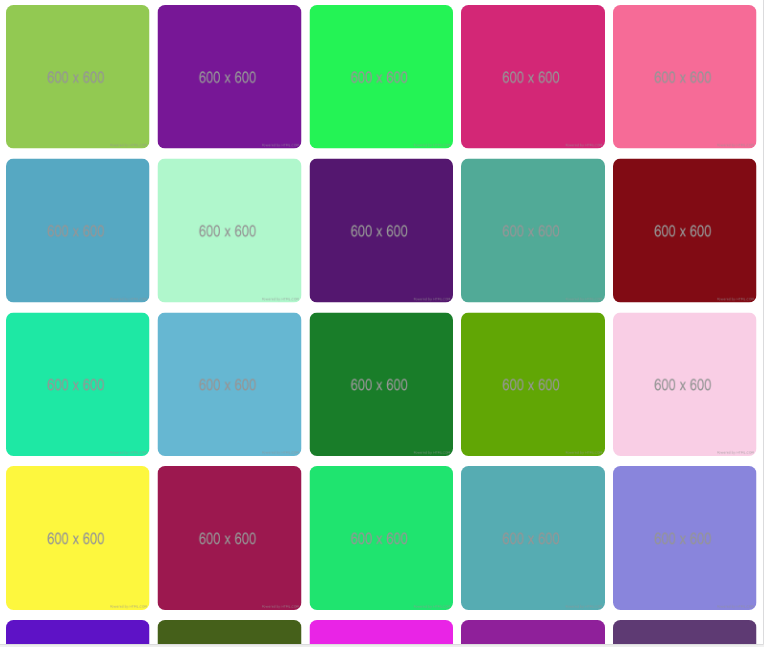
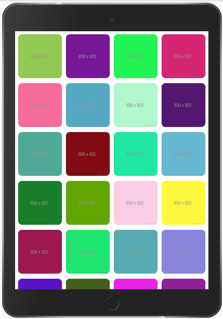
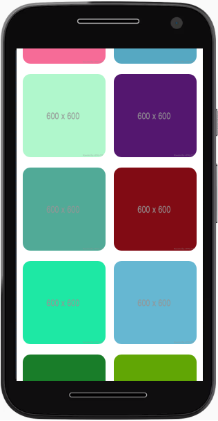

# React Images App

This is a React app to show images from API with infinite scroll

## Project Screen Shot(s)

### Desktop

### Ipad 

### Mobile

## Demo 

## Installation and Setup Instructions

### Example:
Clone down this repository. You will need node and npm installed globally on your machine.

### Installation:

npm install

### To Run Test Suite:

npm test

### To Start App:

npm start
